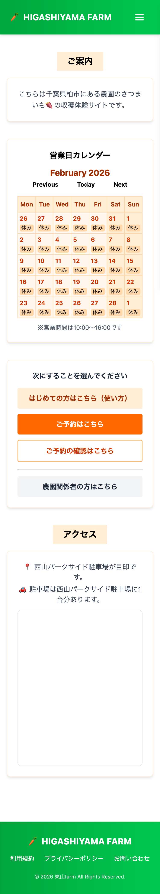
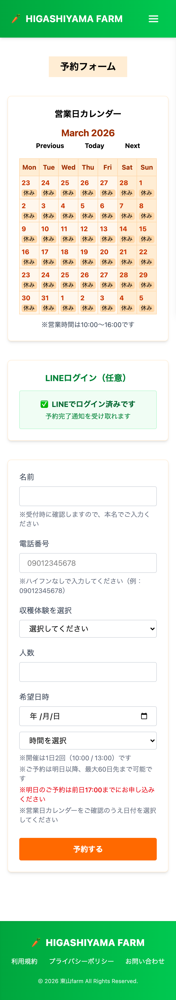
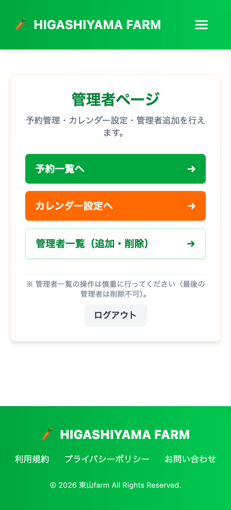

# HIGASHIYAMA FARM（収穫体験予約管理システム）

* **本番URL**：https://higasiyama-farm.com/
* **GitHub Project**：https://github.com/users/monster-kei28/projects/7

> 実在農園向けに設計・開発した収穫体験予約管理Webアプリケーション  
> Issue駆動で設計・実装し、約26日（5週間）で本リリースを想定した個人開発プロジェクトです。

---

## 🌱 サービス概要

HIGASHIYAMA FARMは、  
千葉県柏市の農園で開催される「さつまいも収穫体験」のためのオンライン予約管理システムです。

従来は電話予約のみで運営されており、

- 電話応対に常に備える必要がある状況
- 予約をカレンダーアプリで個別入力する手間
- 個人農園のため営業日管理の仕組みがない

といった課題がありました。

本システムはそれらを解決し、  
**電話予約に依存しない持続可能な運営体制**を実現することを目的としています。

---

## 🎯 解決した課題

### ① 電話予約依存からの脱却
→ Web予約導入により24時間受付を実現

### ② 予約管理の手作業負担
→ 予約内容をデータベースへ自動保存  
→ 管理画面で即時確認可能

### ③ 営業日管理の不在
→ CalendarEventモデルで営業日／休業日をデータ管理  
→ 受付可否を自動制御

---

## 👤 想定ユーザー

### 一般利用者
- 家族・カップル・友人グループ
- スマホで簡単に予約を完結させたい利用者

### 農園スタッフ・管理者
- 予約管理を効率化したい
- 営業日程を柔軟に設定したい
- 当日の運営に集中したい

---

## 🧠 設計の意図

### ■ 会員登録を必須にしない設計

地域密着型サービスであるため、  
「予約の心理的ハードルを下げること」を最優先にしました。

- 名前・電話番号のみで予約可能
- LINEログインは任意
- 通知はログインユーザーのみ

UXを優先した導線設計にしています。

---

### ■ 管理者はホワイトリスト管理

管理者権限は role カラムではなく、  
**Adminテーブルによるホワイトリスト制御**を採用。

- 一般ユーザーと管理者を明確に分離
- 誤付与リスクの低減
- 将来の権限拡張に対応可能

`Admin::BaseController`で権限制御を一元管理しています。

---

### ■ 営業日をデータで管理

営業日／休業日は `CalendarEvent` モデルで管理。

- 管理画面から日付単位で設定可能
- サーバ側バリデーションで安全性担保
- 将来的な拡張に対応可能な構造

UIだけでなく、必ずサーバ側でも予約を制御しています。

---

### ■ 外部依存を最小化

LINE通知は外部APIを利用していますが、

- 通知失敗時も予約は成功
- 予約機能はAPI非依存

という構成により、可用性を優先しています。

---

## 🧩 主な機能

### 一般ユーザー
- 予約作成（名前・電話番号・人数・日時）
- 予約確認
- キャンセル
- LINEログイン（任意）

### 管理者
- 管理者ログイン（LINE + Adminテーブル）
- 予約一覧表示
- 営業日設定（CalendarEvent）
- 管理者追加／削除

---

## 🛠 技術スタック

### Backend
- Ruby 3.3.6
- Rails 7.2.1
- PostgreSQL

### Frontend
- Tailwind CSS

### 認証・外部連携
- OmniAuth（LINEログイン）
- LINE Messaging API

### インフラ
- Render

---

## 🧪 品質担保

- RSpec（Model / Request）
- RuboCop
- GitHub ActionsによるCI

---

## 🔮 将来対応（Backlog）

- LIFFを用いたLINE内予約フロー
- 多言語対応
- LINEで管理者に通知を送信する
- 予約リマインド通知
- 画像付き体験紹介ページ（S3対応）

---

## 📐 設計資料

- ER図（dbdiagram.io）https://dbdiagram.io/d/HIGASHIYAMA-FARM-690a1ae66735e11170347499

---

## 📸 Screenshots

  
  
  

---

## 🚀 開発方針

- Issue駆動開発
- 1 Issue = 半日〜2日の粒度
- MVP → 本リリース → 拡張

---